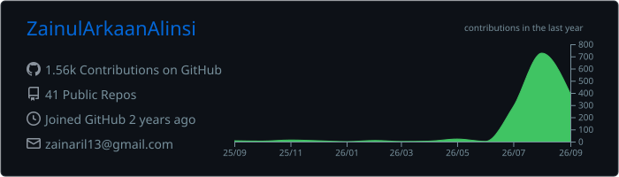
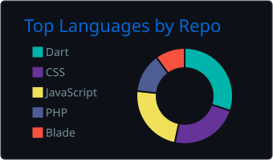
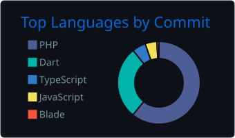

<div align="center">


<a href="https://github.com/ZainulArkaanAlinsi">
  
</a>

<p>
  <a href="https://instagram.com/zainarilbre"></a>
  <a href="https://linkedin.com/in/zainul-arkaan-3bb51731a"></a>
  <a href="https://www.youtube.com/@zainarilbre"></a>
  <a href="mailto:zainaril13@gmail.com"></a>
  
</p>

</div>

<br/>

### `❯ cat about.ts`

```ts
const zainul = {
  role:      "Full-Stack Developer",
  school:    "IDN Boarding School — growing future tech leaders",
  web:       ["PHP", "Laravel", "Next.js", "Tailwind CSS"],
  mobile:    ["Flutter (deep-diving)", "React Native"],
  mindset:   "efficient code → impactful solutions",
  currently: "building, breaking, and learning in public",
} as const;
```

<br/>

### `❯ ls ./stack`

<table>
  <tr>
    <td width="120"><code>languages</code></td>
    <td></td>
  </tr>
  <tr>
    <td><code>frameworks</code></td>
    <td></td>
  </tr>
  <tr>
    <td><code>data & cloud</code></td>
    <td></td>
  </tr>
  <tr>
    <td><code>tools</code></td>
    <td></td>
  </tr>
  <tr>
    <td><code>also</code></td>
    <td>
      
      
      
      
      
      
    </td>
  </tr>
</table>

<br/>

### `❯ git log --stats`

<div align="center">







</div>

<br/>

### `❯ ./snake --eat contributions`

<picture>
  <source media="(prefers-color-scheme: dark)" srcset="https://raw.githubusercontent.com/ZainulArkaanAlinsi/ZainulArkaanAlinsi/output/github-snake-dark.svg" />
  <source media="(prefers-color-scheme: light)" srcset="https://raw.githubusercontent.com/ZainulArkaanAlinsi/ZainulArkaanAlinsi/output/github-snake.svg" />
  
</picture>

<br/>

<div align="center">


<sub><code>// rendered in ASCII · generated with love from Indonesia 🇮🇩</code></sub>

</div>
